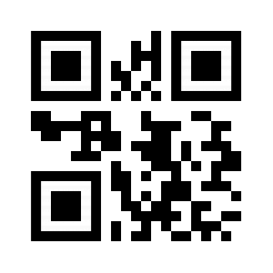

# Restaurant "La comanda"

# Nombre del equipo: 
 - ## Equipo3

# Integrantes:
 - ### Gustavo Petruzzi 
 - ### Sabrina Veiga  

 
## ¿De que se trata el proyecto?
_El Proyecto Consiste En Desarrollar Una Aplicacion Para La Gestion De Un Restaurant, Enfocada En La Experiencia De Usuario._

## ¿Como se va a desarrollar el proyecto?
_El proyecto se va a estar orientada a dispositivos moviles, desarrollada a traves de [Ionic ](https://ionicframework.com/ "Ionic "), utilizando como base de datos [Firebase](https://firebase.google.com/?hl=es-419 "Firebase")_

***

### Perfiles de usuarios:
-  #### Dueño
-  #### Supervisor
-  #### Empleado
  - ##### Bartender
  - ##### Cocinero
  - ##### Mestre
  - ##### Mozo
 
 # Responsabilidades por Integrante:
##  - Petruzzi
##  - Gustavo

|   Responsabilidad | Estado   |
| :------------: | :------------: |
|  Alta de plato |   |
|  Alta de bebida |   |
|  Alta de supervisor |   |
|  Alta de dueño |   |
|  Qr de propina |   |
|  Splash |   |
|  Login |   |
|  Encuesta Supervisor  |     |
|  Alta cliente anonimo  |     |
|  Qr lista espera  |     |
 
##  - Veiga
##  - Sabrina
|   Responsabilidad | Estado   |
| :------------: | :------------: |
|  Menu Principal|   |
|  Alta de Cliente |   |
|  Encuesta entrada-salida |    |
|  Encuesta Satisfaccion |     |
|  Gestion de mesas |     |
|  Alta de pedido |     |
|  Gestion de pedidos  |     |
|  Qr de la mesa  |     |
|  Alta de mesa  |     |
|  Reservas(cliente)  |     |
|  Push notification (pedir cuenta)  |     | 

# Tutoriales

## Cargar un nuevo plato

## El cliente hace una reserva

## El cocinero prepara un pedido

# Codigos qr

## lista de espera (cliente)

## Propinas

### 0%

### 5%

### 10%

### 15%

### 20%

## Mesas

 
https://docs.google.com/spreadsheets/d/1nk1voMplk4VpQ3R_nmYqD3kn0eXW3lus535L_qwjRFU/edit?usp=sharing
